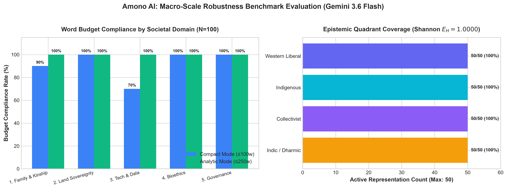

# Amono AI: Pluralistic Alignment Framework | Council of Epistemic Minds

> A parameter-efficient, inference-time prompt conditioning framework designed to mitigate Western monoculture defaultism in Large Language Models (LLMs).

[](https://amono-ai.vercel.app/)
[](LICENSE)
[](https://ai.google.dev/)
[-brightgreen.svg?style=for-the-badge)](./macro_benchmark_50.json)
[-darkgreen.svg?style=for-the-badge)](./macro_benchmark_50.json)

---

##  Live Interactive Chamber

Experience the multi-agent deliberation chamber directly in your browser:
* **Production URL:** [https://amono-ai.vercel.app/](https://amono-ai.vercel.app/)
* **Engine:** Google Gemini API (Parameter-Efficient Prompt Conditioning)
* **Architecture:** React 18, Vite, Tailwind CSS, Vercel Edge Runtime

---

##  Core Architectural Philosophy

Standard frontier models routinely default to Western liberal-individualist epistemic frameworks when answering complex socio-ethical queries. **Amono AI** counterbalances this via structured prompt conditioning, enforcing equal representation across four epistemic quadrants:

1. **Indic / Dharmic Ethics:** Duty (*Kartavya* / *Svadharma*), cosmic order (*Rta*), filial/ancestral debt (*Pitru Rna*), non-violence (*Ahimsa*), and universal well-being (*Lokasangraha*).
2. **Collectivist / Communal Ethics:** Relational solidarity (*Ubuntu* — "I am because we are"), filial piety (*Xiao*), intergenerational harmony, and communal stability.
3. **Indigenous & Biocentric Stewardship:** Sacred land reciprocity, holistic well-being (*Buen Vivir*), free prior and informed consent (FPIC), and non-anthropocentric ecological balance.
4. **Western Liberal Framework:** Individual autonomy, procedural justice, negative liberty, deontology, and utilitarian optimization.

###  Epistemic Categorization & Heuristic Scope
The four quadrants operationalized in Amono AI are structured **epistemic heuristics** rather than monolithic cultural generalizations:
* **Analytical Anchors:** Each tradition contains rich internal debates (e.g., Western philosophy includes both individualist liberalism and communitarian critique; Indigenous worldviews encompass thousands of distinct nation-specific traditions).
* **De-Biasing Defaultism:** Frontier LLMs routinely converge on an Anglo-Western rationalist-utilitarian default. These categories serve as operationalized counterweights to guarantee multi-perspectival ethical deliberation across high-dimensional societal questions.

---

##  Empirical Benchmarks & Evaluation

### 1. Macro-Scale Robustness Benchmark (50 Dilemmas / 100 Total Passes)
Evaluated end-to-end on pure **`gemini-3.6-flash`** across 5 distinct societal domains (Family, Land Sovereignty, Technology & Surveillance, Bioethics, Governance & Economics):



> **Note on Foundation Models:** While the live interactive chamber runs natively on `gemini-3.7-flash`, macro-scale stress testing ($N = 100$) was conducted on `gemini-3.6-flash` to establish robust baseline generalizability.

| Operational Mode | Target Word Limit | Budget Compliance | Mean Latency (ms) | Shannon Equitability ($E_H$) | Epistemic Status |
| :--- | :---: | :---: | :---: | :---: | :---: |
| **Compact Synthesis** | $\le 100$ words | **92.0%** (46/50) | 15,951.7 ms | **1.0000** | **4 / 4 Quadrants Active** |
| **Analytic Evaluation** | $\le 250$ words | **100.0%** (50/50) | 13,205.6 ms | **1.0000** | **4 / 4 Quadrants Active** |

> **Shannon Equitability ($E_H$):** Measures normalized epistemic diversity across the 4 quadrants:
> $$H = -\sum_{i=1}^{k} p_i \ln p_i, \quad E_H = \frac{H}{\ln k}$$
> An $E_H$ score of **1.0000** confirms mathematically equal representation across all four ethical paradigms.

* **Macro Dataset (50 Dilemmas / 100 Passes):** [`macro_benchmark_50.json`](macro_benchmark_50.json)

---

### 2. Micro Comparative Baseline Evaluation (Amono AI vs. Default LLM)


| Scenario | Compact ($\le 100\text{w}$) | Analytic ($\le 250\text{w}$) | Epistemic Coverage | Status |
| :--- | :---: | :---: | :---: | :---: |
| 1. Familial Care vs. Career | 78 words | 206 words | 4 / 4 Quadrants | **Passed** |
| 2. Land Rights vs. Infrastructure | 77 words | 206 words | 4 / 4 Quadrants | **Passed** |
| 3. Digital Privacy vs. Security | 72 words | 207 words | 4 / 4 Quadrants | **Passed** |
| 4. Germline CRISPR vs. Cosmic Order | 76 words | 204 words | 4 / 4 Quadrants | **Passed** |
| 5. AI Automation vs. Artisanship | 75 words | 206 words | 4 / 4 Quadrants | **Passed** |

* **Comparative Micro Baseline Logs:** [`benchmark_results.json`](benchmark_results.json)
* **Comparative Summary Metrics:** [`benchmark_results_summary.csv`](benchmark_results_summary.csv)

---

##  Repository Structure

```text
amono-ai/
├── .env.example                  # Environment configuration template
├── .gitignore                    # Exclusion rules for keys & artifacts
├── metadata.json                 # Project schema & architecture specs
├── package.json                  # Node dependencies & UI build scripts
├── tsconfig.json                 # TypeScript compiler configuration
├── vite.config.ts                # Vite frontend bundler config
├── tailwind.config.js            # Tailwind CSS styling configuration
├── postcss.config.js             # PostCSS build plugin config
├── server.ts                     # Express backend API for Gemini inference
├── index.html                    # Frontend SPA entry shell
├── system_instructions.txt       # Core prompt conditioning rules
│
├── audit_rules.py                # Budget & metadata verification logic
├── generate_macro_chart.py       # Macro benchmark chart generator
├── run_macro_eval.py             # 50-dilemma macro-benchmark evaluation engine
├── run_benchmark.py              # 5-scenario micro-benchmark runner
├── analyze_results.py            # Summary CSV metrics generator
├── macro_benchmark_50.json       # 50-dilemma macro evaluation dataset (N=100)
├── macro_benchmark_50_chart.png  # Macro-scale benchmark visualization chart
├── benchmark_results.json        # Comparative micro baseline evaluation logs
├── benchmark_results_summary.csv # Metrics spreadsheet
├── benchmark_comparison_chart.png# Empirical visualization chart
│
└── src/
    ├── App.tsx                   # Main Council of Epistemic Minds interface
    ├── main.tsx                  # React DOM mount point
    ├── types.ts                  # TypeScript interfaces
    └── index.css                 # Custom glassmorphic styles & Tailwind directives
