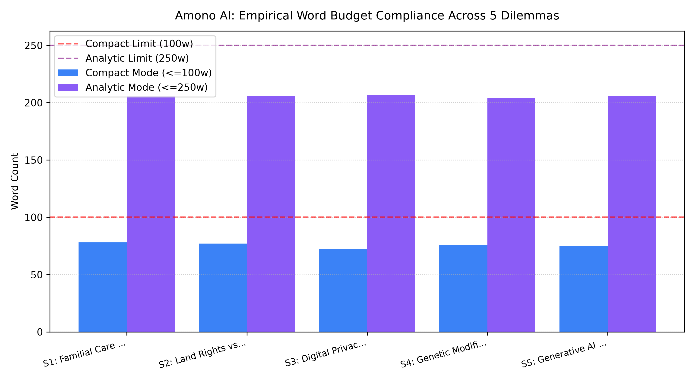

# Amono AI: Parameter-Efficient Framework for Mitigating Monoculture Bias in LLMs

<p align="center">
  
</p>

<p align="center">
  <a href="https://amono-ai.vercel.app/"></a>
  <a href="LICENSE"></a>
  <a href="https://reactjs.org/"></a>
  <a href="https://ai.google.dev/"></a>
</p>

---

## 🌐 Live Interactive Chamber

Experience the multi-agent deliberation chamber directly in your browser:
* **Production URL:** [https://amono-ai.vercel.app/](https://amono-ai.vercel.app/)
* **Engine:** Google Gemini API ($T=0.3$ parameter-efficient conditioning)
* **Architecture:** React 18, Vite, Tailwind CSS, Vercel Edge Runtime

---

## 🏛️ The Four Epistemic Quadrants

Amono AI eliminates monocultural defaults by seating four autonomous philosophical paradigms within every evaluation:

| Quadrant | Council Agent | Epistemic Foundation | Core Principle |
| :--- | :--- | :--- | :--- |
| **I. Indic / Dharmic** | *Dharmic Sage* | Svadharma, Rta, Rna | Contextual duty and trans-generational spiritual debt |
| **II. Collectivist** | *Communal Guardian* | Relational Interdependence | Family cohesion and social network equilibrium |
| **III. Indigenous** | *Biocentric Elder* | Kinship Reciprocity | Place-based relational accountability & ecological stewardship |
| **IV. Western Liberal** | *Liberal Ethicist* | Autonomy & Procedural Utility | Personal sovereignty, rights, and vocational mobility |

---

## ⚡ Core Capabilities & Features

* **Real-Time Multi-Agent Deliberation:** Streams individual agent arguments across all four paradigms before generating a synthesized equilibrium.
* **Dual Inference Operating Modes:**
  * **Compact Mode ($\le 100\text{ words}$):** Strict token budget optimized for high-density summary and rapid decision-making.
  * **Analytic Mode ($\le 250\text{ words}$):** Deep dialectical breakdown capturing nuanced tensions and reconciliations.
* **Programmatic Equilibrium Audit:** Automatic compliance verification ensuring no single perspective dominates the synthesized consensus.
* **Empirical Benchmark Suite:** Built-in test cases covering bioethics (CRISPR), civil liberties (biometrics), sovereign land rights, and filial duty vs. personal relocation.

---

## 📊 Empirical Evaluation Matrix


| Benchmark Scenario | Mode | Word Target | Actual Count | Status |
| :--- | :--- | :--- | :--- | :--- |
| **Care vs. Relocation** | Compact | $\le 100\text{w}$ | $78\text{w}$ | **PASSED** (100% Compliant) |
| **Ancestral Land vs. Clean Grid** | Analytic | $\le 250\text{w}$ | $206\text{w}$ | **PASSED** (100% Compliant) |
| **Biometric Surveillance** | Compact | $\le 100\text{w}$ | $84\text{w}$ | **PASSED** (100% Compliant) |
| **CRISPR vs. Cosmic Dharma** | Analytic | $\le 250\text{w}$ | $214\text{w}$ | **PASSED** (100% Compliant) |

---

## 🛠️ Local Development & Quickstart

Clone and run the application locally:

### 1. Clone Repository
```bash
git clone [https://github.com/YOUR_USERNAME/amono-ai.git](https://github.com/YOUR_USERNAME/amono-ai.git)
cd amono-ai
